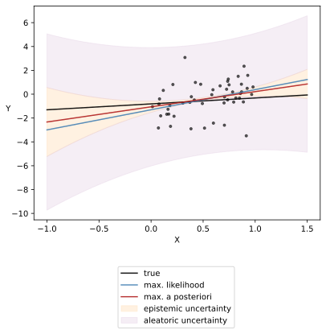
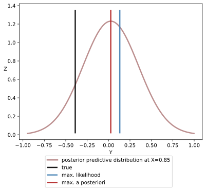

# Probabilistic Artificial Intelligence (PAI)

## Language versions
[](https://www.python.org/downloads/release/python-3111/)

## Run

```zsh
python3 src/main.py
```

## Dockerize

```zsh
docker build -t pai ./
```

```zsh
docker run --rm pai
```

## 1 Bayesian regression

### 1.1 Linear

### 1.1.1 Weight-space-view closed-form Bayesian linear regression

([wsv_cf_blr.py](src/bayesian_regression/linear/closed_form/wsv_cf_blr.py))

Prior: 

$$ \begin{equation} \boldsymbol{w} \sim \mathcal{N} \big( \boldsymbol{\mu}_\text{prior}, \sigma_\text{prior}^2 \boldsymbol{I}  \big) \end{equation} $$

```python
mu_prior = np.array([mu_1, mu_2])

Sigma_prior = np.array([[var_1, cov_1_2], [cov_2_1, var_2]])

w = np.random.multivariate_normal(mean = mu_prior, cov = Sigma_prior)
```

Likelihood: 

$$ \begin{equation} \boldsymbol{y} \mid \boldsymbol{X} , \boldsymbol{w} \sim \mathcal{N} \big( \boldsymbol{X} \boldsymbol{w}, \sigma_\text{aleatoric}^2 \big) \end{equation} $$

Posterior: 

$$ \begin{equation} \boldsymbol{w} \mid \boldsymbol{X}, \boldsymbol{y} \sim \mathcal{N} \big( \boldsymbol{\mu}_\text{posterior}, \boldsymbol{\Sigma}_\text{posterior} \big) \end{equation} $$

$$ \begin{equation} \boldsymbol{\Sigma}_\text{posterior} \doteq \big(\sigma_\text{aleatoric}^{-2} \boldsymbol{X}^{\top} \boldsymbol{X} + \sigma_\text{prior}^{-2} \boldsymbol{I}\big)^{-1} \end{equation} $$

$$ \begin{equation}\begin{split} 
\boldsymbol{\mu}_\text{posterior} &\doteq \big(\boldsymbol{X}^{\top} \boldsymbol{X} + \sigma_\text{aleatoric}^2 \sigma_\text{prior}^{-2} \boldsymbol{I}\big)^{-1} \boldsymbol{X}^{\top} \boldsymbol{y} \\ &= \sigma_\text{aleatoric}^{-2} \boldsymbol{\Sigma}_\text{posterior} \boldsymbol{X}^{\top} \boldsymbol{y} \\ 
\end{split} \end{equation} $$ 

```python
sigm_alea_sq_inv = 1 / (sigma_aleatoric ** 2)

Sigma_posterior = np.linalg.pinv(sigm_alea_sq_inv * X.T @ X + sigm_alea_sq_inv * np.identity(2))

mu_posterior = sigm_alea_sq_inv * Sigma_posterior @ X.T @ Y
```

Posterior predictive distribution:

$$ \begin{equation} \begin{split} y^\ast \mid \boldsymbol{x}^\ast, \boldsymbol{X}, \boldsymbol{y} \sim  \mathcal{N} \big( &\boldsymbol{\mu}_\text{posterior}^{\top} \boldsymbol{x}^\ast , \\ &\boldsymbol{x}^{\ast \top} \boldsymbol{\Sigma}_\text{posterior} \boldsymbol{x}^\ast + \sigma_\text{aleatoric}^2 \big) \end{split} \end{equation} $$

$$ \begin{equation} \sigma^2_\text{epistemic} \doteq \boldsymbol{x}^{\ast \top} \boldsymbol{\Sigma}_\text{posterior} \boldsymbol{x}^\ast \end{equation} $$

```python
MAP = X_out_of_sample @ mu_posterior

three_sigma = 3 * np.diagonal(X_out_of_sample @ Sigma_posterior @ X_out_of_sample.T)

epistemic_y1, epistemic_y2 = MAP - three_sigma, MAP + three_sigma

aleatoric_lower_y1, aleatoric_lower_y2 = epistemic_y1, epistemic_y1 - 3 * sigma_aleatoric

aleatoric_upper_y1, aleatoric_upper_y2 = epistemic_y2, epistemic_y2 + 3 * sigma_aleatoric
```






### 1.1.2 Weight-space-view approximate Bayesian linear regression

### 1.2 Non-linear

### 1.2.1 Bayesian logistic regression

## 2 Bayesian filtering and smoothing

### 2.1 Kalman filters

## 3 Gaussian processes

### 3.1 Closed-form Gaussian processes

Prior: 

$$ f(\boldsymbol{x}) \sim \mathcal{GP}(m_{\text{prior}}(\boldsymbol{x}), k_{\text{prior}}(\boldsymbol{x},\boldsymbol{x}^{\prime})) $$

Posterior: 

$$ f(\boldsymbol{x}) \mid \boldsymbol{X}, \boldsymbol{y} \sim \mathcal{N}(m_{\mathrm{posterior}}(\boldsymbol{x}), k_{\mathrm{posterior}}(\boldsymbol{x},\boldsymbol{x}')) $$

$$ y \mid \boldsymbol{X}, \boldsymbol{y} \sim \mathcal{N}(m_{\mathrm{posterior}}(\boldsymbol{x}), k_{\mathrm{posterior}}(\boldsymbol{x},\boldsymbol{x}') + \sigma_\text{aleatoric}^2) $$

$$ m_{\mathrm{posterior}}(\boldsymbol{x}) \doteq m_{\mathrm{prior}}(\boldsymbol{x}) + \boldsymbol{k}(\boldsymbol{x},\boldsymbol{X}) [\boldsymbol{K}(\boldsymbol{X},\boldsymbol{X}) + \sigma_\text{aleatoric}^2\boldsymbol{I}]^{-1} (\boldsymbol{y}-\boldsymbol{m}(\boldsymbol{X})) $$

$$ k_{\mathrm{posterior}}(\boldsymbol{x},\boldsymbol{x}^{\prime}) \doteq k_{\mathrm{prior}}(\boldsymbol{x},\boldsymbol{x}^{\prime}) - \boldsymbol{k}(\boldsymbol{x},\boldsymbol{X}) [\boldsymbol{K}(\boldsymbol{X},\boldsymbol{X}) + \sigma_\text{aleatoric}^2\boldsymbol{I}]^{-1} \boldsymbol{k}(\boldsymbol{X},\boldsymbol{x}^{\prime}) $$

Posterior predictive distribution:

$$ f^{\ast} \mid \boldsymbol{X}, \boldsymbol{y}, \boldsymbol{x}^{\ast} \sim \mathcal{N}(m^{\ast}, k^{\ast}) $$

$$ y^{\ast} \mid \boldsymbol{X}, \boldsymbol{y}, \boldsymbol{x}^{\ast} \sim \mathcal{N}(m^{\ast}, k^{\ast} + \sigma_\text{aleatoric}^2) $$

$$ \left[\begin{array}{c}
\boldsymbol{y} \\
f^{\ast}
\end{array}\right] \sim \mathcal{N}\left(\left[\begin{array}{c}
\boldsymbol{m}(\boldsymbol{X}) \\
m \left(\boldsymbol{x}^*\right)
\end{array}\right],\left[\begin{array}{cc}
K(\boldsymbol{X}, \boldsymbol{X})+\sigma_\text{aleatoric}^2 \boldsymbol{I} & K\left(\boldsymbol{X}, \boldsymbol{x}^{\ast} \right) \\
K\left(\boldsymbol{x}^{\ast}, \boldsymbol{X}\right) & K\left(\boldsymbol{x}^{\ast}, \boldsymbol{x}^{\ast}\right)
\end{array}\right]\right) $$

$$ m^{\ast} \doteq m(\boldsymbol{x}^{\ast}) + \boldsymbol{k}(\boldsymbol{x}^{\ast}, \boldsymbol{X}) [\boldsymbol{K}(\boldsymbol{X}, \boldsymbol{X}) + \sigma_\text{aleatoric}^2 \boldsymbol{I}]^{-1} (\boldsymbol{y} - \boldsymbol{m}(\boldsymbol{X})) $$

$$ k^{\ast} \doteq k(\boldsymbol{x}^{\ast},\boldsymbol{x}^{\ast}) - \boldsymbol{k}(\boldsymbol{x}^{\ast},\boldsymbol{X}) [\boldsymbol{K}(\boldsymbol{X},\boldsymbol{X}) + \sigma_\text{aleatoric}^2 \boldsymbol{I}]^{-1} \boldsymbol{k}(\boldsymbol{X}, \boldsymbol{x}^{\ast}) $$

### 3.2 Gaussian processes with linear kernel aka function-space-view Bayesian linear regression

### 3.3 Brownian motion

## 4 Bayesian deep learning

### 4.1 Variational inference aka Bayes by backprop

### 4.2 Markov chain Monte Carlo

### 4.3 Monte Carlo dropout

### 4.4 Probabilistic ensembles

## 5 Bayesian optimization

## 6 Reinforcement learning